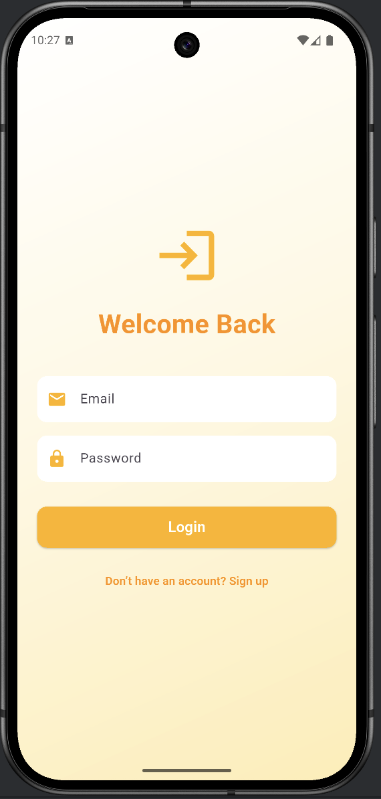
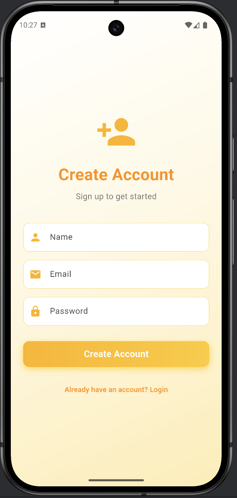
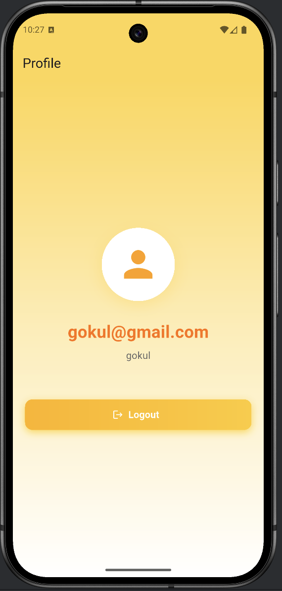

# Login App - Flutter Authentication System

A beautiful and modern Flutter authentication application with BLoC state management, featuring email validation, user signup/login, and a gradient-themed UI.

## 📱 Screenshots

<div style="display: flex; justify-content: space-between;">
  
  
  
</div>

## ✨ Features

- **User Authentication**: Complete signup and login functionality
- **Email Validation**: Real-time email format validation using RegEx
- **Password Requirements**: Minimum 5 characters password validation
- **BLoC State Management**: Clean architecture with flutter_bloc
- **Beautiful UI**: White-to-yellow gradient theme throughout the app
- **Form Handling**: Proper text input actions and keyboard management
- **Session Management**: Secure logout with navigation stack clearing
- **Responsive Design**: Adaptive layout with proper spacing and styling

## 🎨 Design Features

- **Gradient Backgrounds**: Smooth white-to-amber gradient transitions
- **Modern Input Fields**: Rounded corners with amber accent borders
- **Icon Prefixes**: Email, lock, and person icons for better UX
- **Gradient Buttons**: Eye-catching amber gradient buttons with shadows
- **Loading States**: Circular progress indicators during authentication
- **Error Handling**: User-friendly snackbar messages for errors

## 🏗️ Project Structure

```
login_app/
├── lib/
│   ├── main.dart                    # App entry point
│   ├── bloc/
│   │   ├── auth_bloc.dart          # Authentication BLoC
│   │   ├── AuthEvent/
│   │   │   ├── AuthEvent.dart      # Base event class
│   │   │   ├── LoginEvent.dart     # Login event
│   │   │   ├── SignupEvent.dart    # Signup event
│   │   │   └── LogoutEvent.dart    # Logout event
│   │   └── AuthState/
│   │       ├── auth_state.dart     # Base state class
│   │       ├── Auth_initial_state.dart
│   │       ├── auth_loading_state.dart
│   │       ├── auth_success_state.dart
│   │       └── auth_failure_state.dart
│   └── ui/
│       ├── LoginPage.dart          # Login screen
│       ├── Signup.dart             # Signup screen
│       └── Home.dart               # Profile/Home screen
├── images/                          # App screenshots
└── pubspec.yaml                     # Dependencies
```

## 🚀 Getting Started

### Prerequisites

- Flutter SDK (>=3.0.0)
- Dart SDK (>=3.0.0)
- Android Studio / Xcode for emulators
- VS Code or Android Studio IDE

### Installation

1. **Clone the repository**
   ```bash
   git clone <repository-url>
   cd login_app
   ```

2. **Install dependencies**
   ```bash
   flutter pub get
   ```

3. **Run the app**
   ```bash
   flutter run
   ```

## 📦 Dependencies

```yaml
dependencies:
  flutter:
    sdk: flutter
  flutter_bloc: ^8.1.3  # State management
```

## 🔧 How It Works

### Authentication Flow

1. **Signup**: 
   - User enters name, email, and password
   - Email format is validated using RegEx pattern
   - Password must be at least 5 characters
   - User data is stored in-memory (Map structure)
   - On success, navigate to Profile page

2. **Login**:
   - User enters email and password
   - Credentials are validated against stored users
   - On success, navigate to Profile page
   - On failure, show error message

3. **Logout**:
   - Clear authentication state
   - Navigate back to Login page
   - Clear navigation stack

### Email Validation

The app uses a comprehensive RegEx pattern for email validation:
```dart
RegExp(r'^[a-zA-Z0-9._%+-]+@[a-zA-Z0-9.-]+\.[a-zA-Z]{2,}$')
```

This validates:
- Valid characters before @
- Domain name structure
- Minimum 2-character TLD

## 🎯 Key Fixes Implemented

1. **Email Validation Issue**: Fixed parameter order in SignupEvent constructor
2. **Premature Form Submission**: Added proper textInputAction handlers
3. **Back Arrow Removal**: Set `automaticallyImplyLeading: false` in Profile page
4. **Logout Navigation**: Changed from `Navigator.pop()` to `pushAndRemoveUntil()`
5. **Loading State Management**: Moved validation before loading state emission

## 🎨 Theming

The app uses a consistent amber/yellow gradient theme:

**Colors:**
- Primary: `Colors.amber.shade600`
- Accent: `Colors.amber.shade400`
- Background: White to `Colors.amber.shade100` gradient
- Text: `Colors.amber.shade800` for headings
- Borders: `Colors.amber.shade200`

**Design Elements:**
- Border Radius: 12px for rounded corners
- Shadows: Amber-tinted box shadows
- Input Fields: White background with amber borders
- Buttons: Gradient fill with shadow effects

## 🔐 Security Note

⚠️ **Important**: This is a demonstration app. User data is stored in-memory only and will be lost when the app closes. For production use, implement:
- Secure backend authentication
- Encrypted password storage
- JWT tokens or OAuth
- Persistent storage (SQLite, Firebase, etc.)
- HTTPS communication

## 📝 Future Enhancements

- [ ] Persistent storage integration
- [ ] Password visibility toggle
- [ ] "Forgot Password" functionality
- [ ] Email verification
- [ ] Social media login (Google, Facebook)
- [ ] Biometric authentication
- [ ] Profile editing capabilities
- [ ] User avatar upload
- [ ] Form validation improvements
- [ ] Remember me functionality

## 🤝 Contributing

Contributions, issues, and feature requests are welcome!

## 📄 License

This project is open source and available under the [MIT License](LICENSE).

## 👨‍💻 Developer

Created with ❤️ using Flutter and BLoC

---

**Note**: This app demonstrates authentication UI and state management patterns. Always implement proper security measures for production applications.
